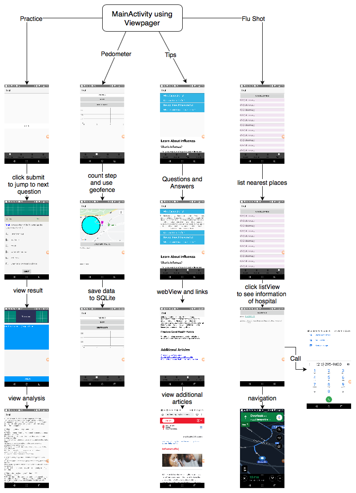

## Introduction
An Android application that helps people understand and prevent influenza.

It is a comprehensive application designed for the citizens of Cleveland. Its functions mainly include: searching for nearby places where the flu vaccine can be gotten, a pedometer for users to maintain good health, and alerting users to nearby flu infection areas and some flu knowledge.

## User Guide
”__Practice__”: Users can determine whether they have mastered flu-related knowl- edge by doing multiple-choice questions. After completing all questions, users are able to browse the correct answers and analysis.

”__Pedometer__”: To start recording, click ”Running”, then the application will start recording user’s path and step count. When the recording is stopped, the user can view the records of past seven days by clicking ”SHOW”. To delete the data, just click ”delete SQLite”.

”__Tips__”: This section is mainly used to allow users to learn the basics of influenza and flu vaccines and to answer some high-frequency questions.

“__Flu shot__”: Search for the nearest pharmacies and clinics for flu vaccine. After clicking ”Scan”, a listview which contains names of pharmacies and clinics will be shown on the interface. Users can click on any location to let the application display detailed information of the current location and can use this interface to make calls or navigate to the destination.

